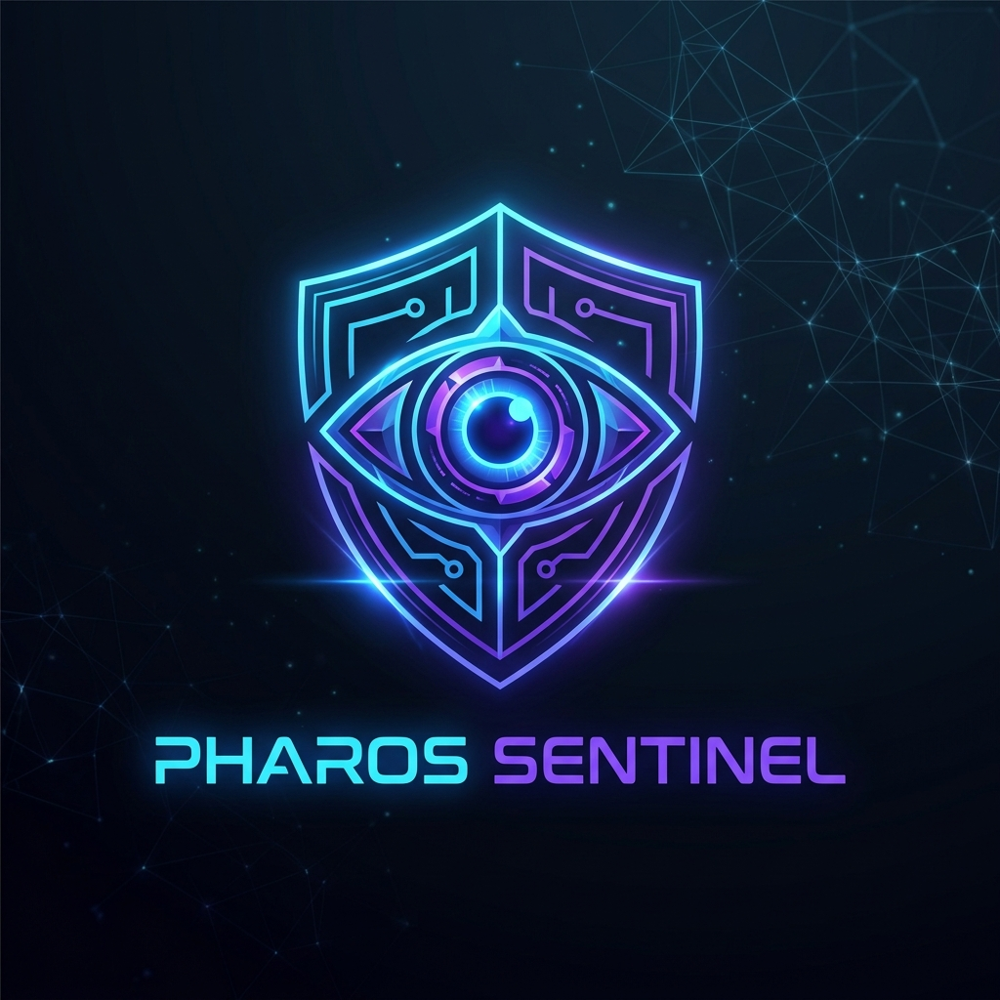

# Pharos SPN Sentinel

<div align="center">



**Autonomous AI Security Shield and Staking Yield Optimizer for the Pharos AI Agent Economy**

[](https://opensource.org/licenses/Apache-2.0)
[]()
[]()
[](https://pharos-spn-sentinel.vercel.app/)

</div>

---

Pharos SPN Sentinel is an autonomous AI security agent built for the Pharos Layer-1 blockchain. It provides 3 composable, reusable Skills that any AI agent can call to audit smart contracts, optimize gas fees, and evaluate validator trust before staking or restaking into Pharos Special Processing Networks (SPNs).

The Guardian Agent composes all 3 skills into an autonomous background daemon that defends wallets from malicious tokens and delegates idle PROS to safe, decentralized validators.

---

## Problem

AI agents operating on-chain face three core risks:

1. **Contract Safety** -- Malicious tokens, honeypots, upgradable proxies, and hidden blacklists can drain agent wallets.
2. **Validator Risk** -- Staking or restaking into centralized or unproven node operators exposes capital to slashing and concentration risk.
3. **Gas Inefficiency** -- Pharos uses an EIP-1559 gas refund mechanism. Agents that ignore it overpay or run out of gas.

---

## Skills (Phase 1 Submission)

Three modular, reusable AI Agent Skills. Each has its own `SKILL.md`, standalone scripts, MCP tool registration, and REST API endpoint.

### 1. Smart Contract Bytecode Auditor (`pharos-token-auditor`)

Audits contract bytecode using static heuristics to detect honeypots, hidden mint privileges, blacklists, and proxy patterns (DELEGATECALL). Returns a safety score from 0 to 100 with a recommendation of SAFE, CAUTION, or DANGEROUS.

- Skill directory: `skills/pharos-token-auditor/`
- Service: `src/services/token-auditor.ts`
- MCP tool: `auditToken`
- API: `GET /api/audit-token?address=0x...`

### 2. Gas Refund Optimizer (`pharos-gas-optimizer`)

Monitors Pharos L1 gas prices and calculates optimal maxFeePerGas with the 20% Pharos gas refund buffer. Reports network congestion level and recommended transaction timing.

- Skill directory: `skills/pharos-gas-optimizer/`
- Service: `src/services/gas-monitor.ts`
- MCP tool: `estimateOptimalGas`
- API: `GET /api/gas-estimate`

### 3. Validator Trust Assessor (`pharos-validator-trust`)

Calculates the L1 Nakamoto Coefficient from recent block producers to measure validator decentralization. Cross-references operator reputation on Ethereum Mainnet via the Blockscout PRO API (ETH balance, transactions, blocks mined). Returns a combined trust score and risk level.

- Skill directory: `skills/pharos-validator-trust/`
- Service: `src/services/validator-trust.ts`
- MCP tool: `getValidatorTrust`
- API: `GET /api/validator-trust?address=0x...`

---

## Guardian Agent (Phase 2 Ready)

The Guardian Agent composes all 3 skills into an autonomous background daemon:

- **Auto-Defend Loop**: Scans wallet token holdings. If a token bytecode scores below 50 (DANGEROUS), the agent autonomously swaps it to USDC using gas-optimized transactions.
- **Auto-Stake Loop**: Evaluates validator decentralization and operator reputation. When risk is low, it restakes idle PROS to high-yield nodes.
- **Chat Interface**: Natural language commands to trigger audits, check gas, or control autonomous features.

MCP tools: `chatWithGuardianAgent`, `toggleAutonomousFeature`, `triggerSecuritySweep`

---

## Pharos Integration

This project is built specifically for the Pharos ecosystem:

- **Pharos L1 RPC**: All on-chain queries go through `https://rpc.pharos.xyz` (Chain ID 1672)
- **PROS Token**: Staking and restaking use the native PROS token
- **EIP-1559 Gas Refund**: The gas optimizer accounts for the Pharos-specific 20% gas refund buffer
- **SPN Restaking**: Validator trust assessment is designed for SPN delegation decisions
- **Nakamoto Coefficient**: Calculated from live Pharos block producer data to measure L1 decentralization
- **pharos-agent-kit**: Uses the official `pharos-agent-kit` npm package for agent toolkit integration

---

## Interfaces

The project exposes three ways to interact with the Sentinel:

1. **Web Dashboard** (`http://localhost:3000` or [pharos-spn-sentinel.vercel.app](https://pharos-spn-sentinel.vercel.app/))
   - AI Agent Chat panel for direct commands
   - Live background terminal showing autonomous loop logs
   - Manual utility panels for each skill
   - Wallet connection and staking controls

2. **Model Context Protocol (MCP) Server** -- 6 registered tools for external LLM clients
   - `npm run mcp`

3. **REST API with Swagger** -- OpenAPI documentation at `/api-docs`
   - `npm run dev`

---

## Quick Start

```bash
# Install dependencies
npm install

# Configure environment variables
cp .env.example .env
# Set your BLOCKSCOUT_API_KEY inside the .env file

# Run the web dashboard and REST API
npm run dev
# Dashboard: http://localhost:3000
# Swagger: http://localhost:3000/api-docs

# Run the MCP server
npm run mcp

# Run unit tests
npm test
# 10/10 tests passing
```

---

## CertiK Skill Scanner Compliance

The codebase follows all security standards required by the CertiK Skill Scanner:

- No shell execution (no `child_process`, `exec`, or `spawn`)
- No local file writes during execution (all state is in-memory)
- Strict input validation using `ethers.isAddress` for all EVM addresses
- Controlled outbound network calls (only Pharos RPC and Blockscout API)
- No hardcoded secrets (all credentials in `.env`, excluded from git)
- Stateless MCP tool execution

---

## Project Structure

```
pharos-spn-sentinel/
  src/
    api/          Express server, Swagger docs, web dashboard
    core/         PharosProvider singleton, types, utilities
    mcp/          MCP server with 6 registered tools
    services/     Token auditor, gas monitor, validator trust, guardian agent
  skills/
    pharos-token-auditor/     Skill module with SKILL.md and scripts
    pharos-gas-optimizer/     Skill module with SKILL.md and scripts
    pharos-validator-trust/   Skill module with SKILL.md and scripts
    pharos-guardian-agent/    Agent skill composing all 3 skills
  tests/          Vitest test suite (10 tests)
  docs/           Architecture documentation
```

---

## Documentation

- [ARCHITECTURE.md](./docs/ARCHITECTURE.md) -- System block diagrams and skill orchestration flow
- [Swagger API Docs](https://pharos-spn-sentinel.vercel.app/api-docs) -- Interactive API documentation

---

## License

Apache-2.0
