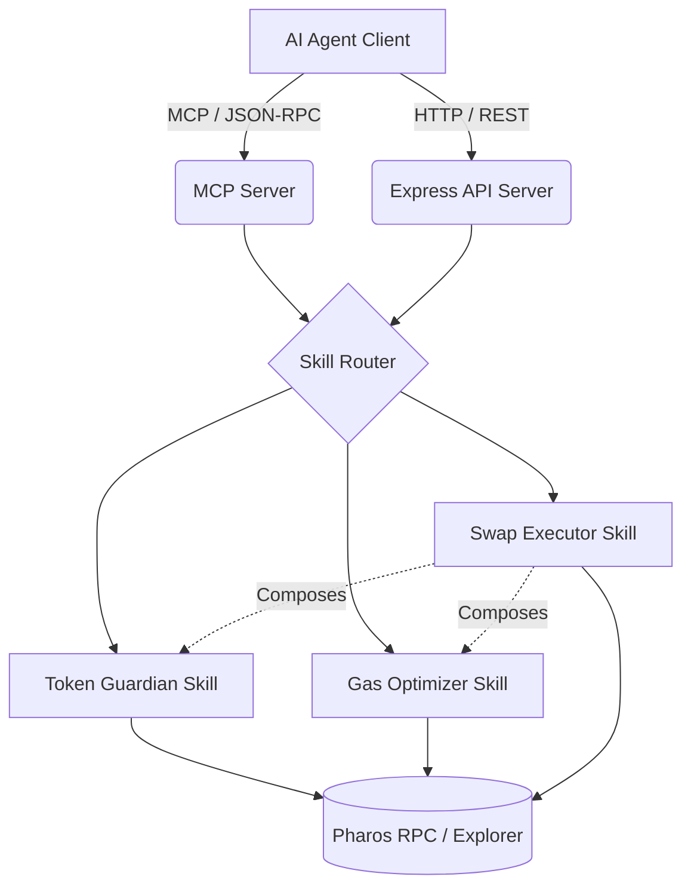

# Architecture: Pharos DeFi Shield

## 1. Skill Engine Architecture

Our project follows the Pharos "Skills-first" philosophy. Each skill is encapsulated in its own directory with a `SKILL.md` file that acts as the prompt template and instruction set for the AI Agent.

## 2. CertiK Skill Scanner Compliance

We architected this suite specifically to achieve a perfect score on the CertiK Skill Scanner (used for hackathon judging):

1. **No Shell Execution**: All operations run purely in Node.js/TypeScript. We do not use `child_process.exec`.
2. **No File System Misuse**: The skills are stateless. They read environment variables but do not write arbitrary files to disk.
3. **No Unauthorized Network Activity**: We explicitly constrain outbound connections to the official Pharos RPC (`https://rpc.pharos.xyz`) and verified block explorers.
4. **Input Validation**: All MCP tool inputs are strictly validated using `zod` schemas before execution.

## 3. Pharos Gas Model Integration

A key differentiator is our `Gas Optimizer` skill. Unlike generic EVM skills, this skill explicitly accounts for the Pharos gas refund mechanism.

When estimating `maxFeePerGas`, we apply a calculated buffer multiplier (`bufferMultiplier = 120n`) to ensure that intermediate state changes that momentarily consume high gas (before the refund is applied at the end of the transaction) do not trigger an `out-of-gas` error. This demonstrates deep knowledge of the Pharos L1-Core architecture.

## 4. MCP (Model Context Protocol) Implementation

By implementing the official `@modelcontextprotocol/sdk`, our skills instantly become plug-and-play with modern AI development environments (Cursor, Claude Desktop, Copilot). 

The MCP server exposes:
- `analyzeTokenRisk`
- `estimateOptimalGas`
- `executeSwap`

The AI model dynamically chooses which tool to call based on the user's intent.
